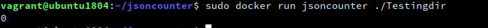
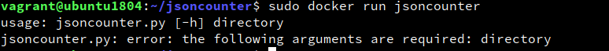
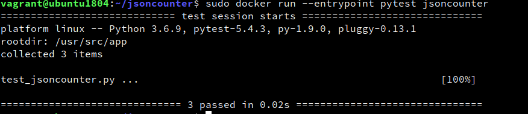

# Creating a docker image

1. I created a simple Dockerfile similar to the article provided, as we are just running a python script I decided to use the official slim python image, it will simply copy the files from the current directory to the working directory. Afterward, it will get pip to install pytest as I have included some unit tests. We then configure ENTRYPOINT to run the script. We use ENTRYPOINT to allow us to provide additional parameters without overwriting the base "python jsoncounter.py" command.
2. We then run `sudo docker build --tag jsoncounter .` to build the image using the Dockerfile in the same directory and tagging it as 'jsoncounter'. Below is the output:
```console
vagrant@ubuntu1804:~/jsoncounter$ sudo docker build --tag jsoncounter .
Sending build context to Docker daemon  5.632kB
Step 1/5 : FROM python:3.6.9-slim
 ---> add6920a081f
Step 2/5 : WORKDIR /usr/src/app
 ---> Using cache
 ---> b14ef79eaacc
Step 3/5 : COPY . .
 ---> 6b8012547193
Step 4/5 : RUN pip install pytest
 ---> Running in 8d47c3105bf8
Collecting pytest
  Downloading https://files.pythonhosted.org/packages/9f/f3/0a83558da436a081344aa6c8b85ea5b5f05071214106036ce341b7769b0b/pytest-5.4.3-py3-none-any.whl (248kB)
Collecting packaging
  Downloading https://files.pythonhosted.org/packages/46/19/c5ab91b1b05cfe63cccd5cfc971db9214c6dd6ced54e33c30d5af1d2bc43/packaging-20.4-py2.py3-none-any.whl
Collecting attrs>=17.4.0
  Downloading https://files.pythonhosted.org/packages/a2/db/4313ab3be961f7a763066401fb77f7748373b6094076ae2bda2806988af6/attrs-19.3.0-py2.py3-none-any.whl
Collecting importlib-metadata>=0.12; python_version < "3.8"
  Downloading https://files.pythonhosted.org/packages/8e/58/cdea07eb51fc2b906db0968a94700866fc46249bdc75cac23f9d13168929/importlib_metadata-1.7.0-py2.py3-none-any.whl
Collecting wcwidth
  Downloading https://files.pythonhosted.org/packages/59/7c/e39aca596badaf1b78e8f547c807b04dae603a433d3e7a7e04d67f2ef3e5/wcwidth-0.2.5-py2.py3-none-any.whl
Collecting pluggy<1.0,>=0.12
  Downloading https://files.pythonhosted.org/packages/a0/28/85c7aa31b80d150b772fbe4a229487bc6644da9ccb7e427dd8cc60cb8a62/pluggy-0.13.1-py2.py3-none-any.whl
Collecting more-itertools>=4.0.0
  Downloading https://files.pythonhosted.org/packages/ef/9b/6c35ec5483710492e21252465160ee508170159f7e0e2d6cd769022f52f6/more_itertools-8.4.0-py3-none-any.whl (43kB)
Collecting py>=1.5.0
  Downloading https://files.pythonhosted.org/packages/68/0f/41a43535b52a81e4f29e420a151032d26f08b62206840c48d14b70e53376/py-1.9.0-py2.py3-none-any.whl (99kB)
Collecting six
  Downloading https://files.pythonhosted.org/packages/ee/ff/48bde5c0f013094d729fe4b0316ba2a24774b3ff1c52d924a8a4cb04078a/six-1.15.0-py2.py3-none-any.whl
Collecting pyparsing>=2.0.2
  Downloading https://files.pythonhosted.org/packages/8a/bb/488841f56197b13700afd5658fc279a2025a39e22449b7cf29864669b15d/pyparsing-2.4.7-py2.py3-none-any.whl (67kB)
Collecting zipp>=0.5
  Downloading https://files.pythonhosted.org/packages/b2/34/bfcb43cc0ba81f527bc4f40ef41ba2ff4080e047acb0586b56b3d017ace4/zipp-3.1.0-py3-none-any.whl
Installing collected packages: six, pyparsing, packaging, attrs, zipp, importlib-metadata, wcwidth, pluggy, more-itertools, py, pytest
Successfully installed attrs-19.3.0 importlib-metadata-1.7.0 more-itertools-8.4.0 packaging-20.4 pluggy-0.13.1 py-1.9.0 pyparsing-2.4.7 pytest-5.4.3 six-1.15.0 wcwidth-0.2.5 zipp-3.1.0
WARNING: You are using pip version 19.3.1; however, version 20.1.1 is available.
You should consider upgrading via the 'pip install --upgrade pip' command.
Removing intermediate container 8d47c3105bf8
 ---> b88ac0dd57c9
Step 5/5 : ENTRYPOINT ["python3",  "jsoncounter.py"]
 ---> Running in eed52d3b34be
Removing intermediate container eed52d3b34be
 ---> 2914a357c67e
Successfully built 2914a357c67e
Successfully tagged jsoncounter:latest
```

3. Next we run `sudo docker run jsoncounter ./Testingdir`, Testingdir is an empty directory I created in the same directory. As we can see it returns the expected output
    
    We can also see that the expected behaviour occurs when we run without any arguments
    
    
    If we want to run our unit tests, we simply need to run `sudo docker run --entrypoint pytest jsoncounter`. As we can see, all tests pass successfully
    
