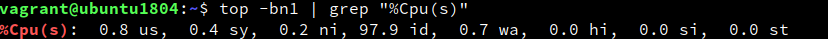
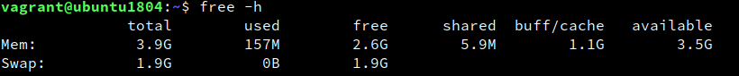
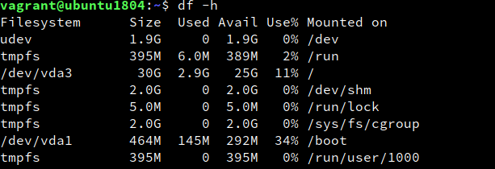
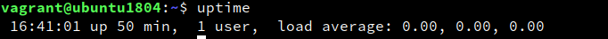
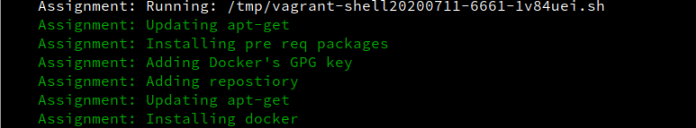
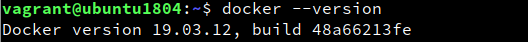
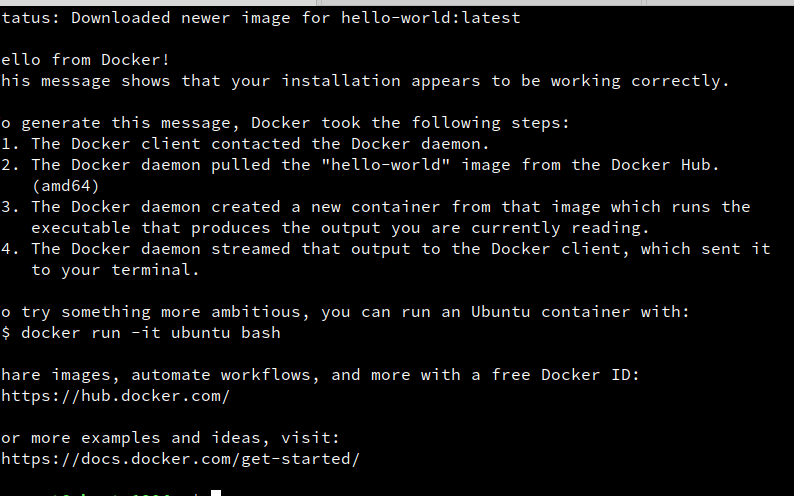

# Creating a development environment

1. I have a development PC configured for virtualization using KVM and libvirt, so I decided to use this. The installation was fairly straightforward using OpenSUSE YaST's handy GUI tool. Simply a matter of flicking a checkbox under "Install Hypervisor and Tools". The process is documented [in OpenSUSEs documentation](https://doc.opensuse.org/documentation/leap/virtualization/html/book.virt/cha-qemu-host.html).  
I have been researching Vagrant lately and had a sample ubuntu Vagrantfile already prepared so I simply swapped around a few entries in the Vagrantfile which were appropriate for this project. Then it was a matter of running `vagrant up` to build the VM!  
2. I then used `vagrant ssh` to login to the VM and did the following
    * Current CPU load: This can be seen in realtime using `top`, if we wanted a simple snapshot we could also use `top -bn1 | grep "%CPU(s)"`. The b flag sets top to execute in 'batch' mode, allowing us to use the output for piping to grep and n sets the number of iterations to occur, in this case 1. The us part is the load used by userland processes, and the sy is the load used by kernel processes, ni are the 'niced' user processes, idle and wait are the processes in idle or waiting for IO respectively. This information was gotten using `man top`
    
      
    
    * Available memory: we can use `top` again or alternatively use `free`. `free -h` gives a more readable format by displaying the data in a clearer human readable table. This displays both Memory usage and Swap, so we might want to pipe it to `grep` to only see Mem if Swap is not required.
    
      
    
    * Available disk space: we can use `df` for this use case, `df` will list all of the disks and their available space. The main disk we're looking at here is /dev/vda3 which root ( / ) is mounted on. If we wanted to only see the space for / we could use `df -h /dev/vda3`.
    
      
    
    * Uptime: we can again see uptime from `top` or we can use `uptime`
    
    
    
3. For installing docker-ce, I decided it would be handy to write a small shell script to do this during provisioning time in Vagrant. I wrote a small shell script to run the required commands from [Docker's installation guide](https://docs.docker.com/get-started/). I was then able to run the shell script from the Vagrantfile via the [config.vm.provision](https://www.vagrantup.com/docs/provisioning/shell.html) shell provisioner. I piped the stdout from the commands to /dev/null and included 2>&1 to redirect stderr to stdout to suppress any warnings or errors, this will keep things nice and clean during provisioning. To flesh this out I might include a "debug" mode to toggle off this behaviour to diagnose any problems.  

    We can then destroy and bring vagrant back up to see the shell script run as per below

      

    Afterward, we can verify that docker is installed via `docker --version` and verify everything is working by running `sudo docker run hello-world`

      

      

Now that we have our development environment provisioned, we can move onto writing the Python script!
