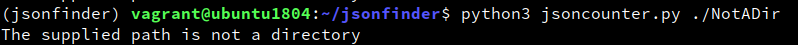
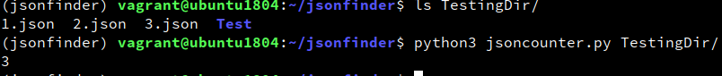

# Developing the Python script

For the python script, I tried to keep to python's built in modules to keep the script standardized. I also tried to use each modules documentation and used stackoverflow when I had some more particular questions. 

* Accepting command line arguments: I decided [argparse](https://docs.python.org/3/library/argparse.html) would be a nice module for this. It allows us to make an argument mandatory, provide a description, and give a nice message to the user if used incorrectly. I wrote the argParse method to do this. I kept it separated to a method to keep the code readable. Below we can see examples of the standard message when the mandatory argument is ommitted and when the help flag is used

* Checking if the directory exists: The standard [os module](https://docs.python.org/3/library/os.html) module seemed like the best tool for this job. We are able to check if a passed path is a valid direcory using the `isdir` method.
    1. If the directory doesn't exist: If isdir evaluates to `False`, our if statement will print to the user that the supplied path is not a directory and exit gracefully using `sys.exit()`
    
    
    
    2. If the directory does exist: If isdir evaluates to `True`, the script continues and will create a list all files that end with .json. I found a [handy list comprehension on a stackoverflow post](https://stackoverflow.com/a/41447012) with a variety of options. `os.listdir` will list all of the files contained in `path`, the comprehension will iterate through the list, with x being each member and then create a new list from the expression x.endswith(".json"). This gives us a list of all files with a json extension. The method will then return the length of this list.
    
    
    
A fairly short and simple script! To flesh this out I would have likely created some flags such as a -v / --verbose flag that would allow us to see information on each file counted and perhaps a -r / --recursive flag that would allow us count json files in all subdirectories.
